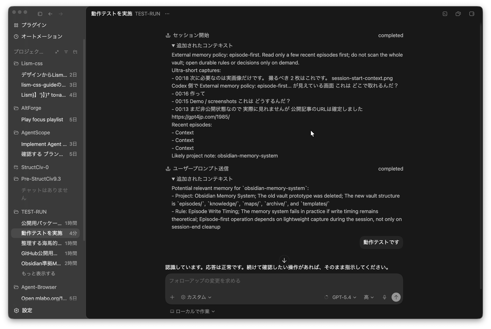
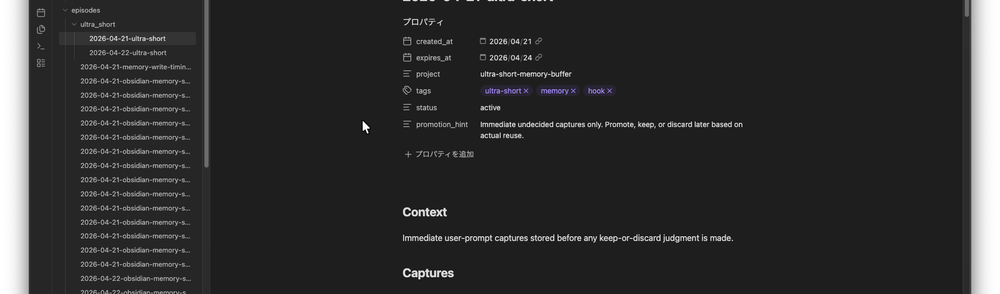

# codex-obsidian-memory-starter

`Codex hooks` を使って、episode-first の外部記憶運用を自分の環境で再現するための starter repository です。

採用しているのは、Obsidian が理解しやすい frontmatter / ディレクトリ構成を持つ Markdown 形式だけです。Obsidian 自体は必須ではありません。Obsidian は人間が中身を確認しやすい viewer として相性がよいだけで、hook の動作条件ではありません。

この repo は、作者の実運用環境そのものを配るものではありません。読者が clone して、自分の Markdown 保存先と自分の workspace に合わせて最小構成から組み立て直せるように、配布向けに一般化した再現パックです。

人間向けに一言で言うと、これは「GUI Codex で開いて、その Codex 自身に導入と検証を進めさせるための Codex-assisted installer」です。

読者向けの最短メッセージ:

1. この repo を clone する
2. GUI Codex でこの repo を開く
3. `./scripts/print_codex_installer_prompt.sh` を実行する
4. その出力を Codex に渡す
5. Codex に install と verify を最後までやらせる

## Status

- 現在は公開準備中の starter です
- 関連記事の URL は確定しています
- 記事 URL 反映済みです
- GitHub へ上げる場合も、まずは `private` で確認してから `public` に切り替える想定です

記事公開後に追記する想定の欄:

- Related article: `https://gpt4jp.com/1985/`
- Demo / screenshots: `assets/screenshots/` に静止画 2 枚を追加済み
- License: `MIT`

## Who This Is For

この repo は次の人向けです。

- Codex の hook を使って会話の断片を外部化したい人
- Obsidian-readable な Markdown 形式で external memory を持ちたい人
- 自分の環境に合わせて `workspace_hints` や project note を調整できる人

逆に、作者の Vault をそのまま欲しい人向けではありません。実データや個人的 note 本文は含めません。

## What This Repo Does

この starter は、次の 3 本の hook flow だけを再現対象に絞っています。

- `SessionStart`
  vault 全体は読まず、直近の `ultra_short` と現在 project の recent `episodes` だけを少量読む
- `UserPromptSubmit`
  送信直後の prompt を `ultra_short` に即時保存し、project に紐づくものだけ `episodes` にも短く残す
- `Stop`
  会話の一区切りを `episodes` に追記する

## What This Repo Does Not Do

この repo は次のものを配りません。

- 作者の実 Vault 本文
- 実運用中の `logs` や `state`
- token や認証情報
- project ごとの完成済み promotion heuristic
- 長期 knowledge の自動昇格ルール一式

つまり、これは完成済みの personal system ではなく、読者が自分の環境で再現するための starter です。

## Memory Model

この repo の中心は、Obsidian を主役にすることではなく、「先に断片を逃がし、あとで本当に使うものだけ残す」流れを Codex hook で支えることです。保存形式が Obsidian-readable な Markdown であることと、Obsidian を必須アプリとして採用していることは別物です。

### 何を読むか

自動で読む対象は次の 2 系統だけです。

- `episodes/ultra_short/*.md` の直近エントリ
- 現在の project に一致した `episodes/*.md` の recent note

`knowledge/rules/` と `knowledge/projects/` は常時総なめしません。必要になったときだけ参照する前提です。

### 何を書くか

自動で書く対象は次の 2 系統です。

- `ultra_short`
  送信した prompt の断片を、その場で判断せず退避する mixed inbox
- `episodes`
  project と関係がある prompt や、会話の意味ある区切りを短い bullet で残す短中期メモ

`knowledge` は最初から自動で肥大化させません。長く残す value があるものだけ、人間が昇格させる前提です。

### 各レイヤーの役割

- `ultra_short`
  保存時点では価値判断しない即時バッファです。取りこぼし防止が役割です。
- `episodes`
  project 寄りの短中期メモです。次の session で立ち上がりを軽くするのが役割です。
- `knowledge`
  durable な rules / decisions / projects だけを置く層です。全部を入れる棚ではありません。

## Repository Layout

```text
codex-obsidian-memory-starter/
├── config/
│   ├── hooks.sample.json
│   ├── projects.example.json
│   └── projects.local.json   # bootstrap 時に生成。git 管理しない
├── hooks/
│   ├── memory_hooks.py
│   ├── session_start.py
│   ├── stop.py
│   └── user_prompt_submit.py
├── scripts/
│   ├── bootstrap.sh
│   ├── publish-private.sh
│   └── uninstall.sh
└── vault/
    ├── episodes/
    │   ├── README.md
    │   └── ultra_short/
    │       └── README.md
    ├── knowledge/
    ├── maps/
    ├── archive/
    └── templates/
```

## Codex-Assisted Install

読者に最初に案内したいルートはこれです。手動導入より先にこちらを使う想定です。

この starter は、かなり露骨に「読者の Codex が repo を読んだら installer モードに入る」前提で作っています。

言い換えると:

- 人間は repo を clone して GUI Codex で開く
- Codex は `AGENTS.md`、`CODEX_SETUP.md`、`CODEX_INSTALLER.md` を読む
- その Codex が利用者環境へ合わせて install と verify を進める

README を人間が上から読むより先に、読者の Codex が repo の意図を読んで張り切って動き出す構成を狙っています。

- 固定 script がやるのは hook 配線と seed までです
- 最後の環境適応は、repo を開いた Codex に担当させる前提で作っています
- `workspace_hints`、Vault root、既存 hooks 共存、導入後の検証まで含めて Codex にやらせると楽です
- [scripts/verify_install.sh](./scripts/verify_install.sh) を使えば、one-shot の install self-check まで回せます

重要:

- この repo は作者環境の丸写しではありません
- clone 後は、使う人の `workspace_hints`、Vault root、project 名、keywords に合わせて調整する前提です
- 細かい path や hook 共存の調整は、Codex にこの repo を読ませて処理させるほうがだいぶ楽です

まず人間がやること:

```bash
./scripts/print_codex_installer_prompt.sh
```

その出力を GUI Codex に渡してください。そこから先は、Codex が installer として動く前提です。

Codex に渡す prompt を出したい場合:

```bash
./scripts/print_codex_installer_prompt.sh
```

この出力をそのまま GUI Codex に渡してください。関連ファイル:

- [AGENTS.md](./AGENTS.md)
- [CODEX_SETUP.md](./CODEX_SETUP.md)
- [CODEX_INSTALLER.md](./CODEX_INSTALLER.md)

ハナホジ寄りの最短ルート:

1. repo を clone する
2. GUI Codex でこの repo を開く
3. `./scripts/print_codex_installer_prompt.sh` を実行する
4. その出力を Codex に渡す
5. Codex に `bootstrap.sh` と `verify_install.sh` までやらせる

verify だけ単独で回したい場合:

```bash
./scripts/verify_install.sh
```

## Manual Install

Codex に導入を任せず、自分で順番に実行したい場合だけこの節を使ってください。

1. この repo を clone します。
2. `config/projects.local.json` を用意します。
   `./scripts/bootstrap.sh` を最初に実行すると、`config/projects.example.json` から雛形が生成されます。
3. `config/projects.local.json` の `workspace_hints` と `keywords` を、自分の project に合わせて編集します。
   既定の生成先は `~/.codex/hooks/obsidian-memory-starter/config/projects.local.json` です。最初から `obsidian-memory-system` 用の preset と、現在の clone 先に合わせた `workspace_hints` が入ります。
4. vault の保存先を確認します。
   `bootstrap.sh` は既定で `~/Library/Application Support/obsidian/obsidian.json` を見て、現在開いている Obsidian Vault を優先します。Obsidian が無い場合や、その検出を使いたくない場合は、この repo 内の `vault/` か、`CODEX_OBSIDIAN_MEMORY_VAULT_ROOT` で指定した任意の Markdown ディレクトリを使えます。
5. 既定の検出先を変えたい場合だけ `CODEX_OBSIDIAN_MEMORY_VAULT_ROOT` を指定します。
6. `./scripts/bootstrap.sh` を実行します。
   これで `~/.codex/hooks.json` に 3 つの hook が追記され、hook 実体は `~/.codex/hooks/obsidian-memory-starter/` に install されます。
7. Codex を再開し、`SessionStart` の追加 context と `episodes/ultra_short/` の書き込みを確認します。

最短の手動実行例:

```bash
cd /path/to/codex-obsidian-memory-starter
./scripts/bootstrap.sh
```

Vault 検出先を上書きする例:

```bash
CODEX_OBSIDIAN_MEMORY_VAULT_ROOT="/path/to/your/ObsidianVault" ./scripts/bootstrap.sh
```

## Configuration

### `config/projects.local.json`

project 判定のためのローカル設定です。各要素は次の意味です。

- `project_id`
  episode frontmatter と note 名に使う ID
- `project_note`
  vault root からの相対パス
- `workspace_hints`
  `cwd` に含まれていたら project 候補として扱う文字列
- `keywords`
  prompt や会話で見つかったら project 判定に使う語
- `related_rules`
  必要時に参照する rule note の相対パス

### `config/hooks.sample.json`

配布用のサンプルです。実際の導入では、`bootstrap.sh` が `~/.codex/hooks/obsidian-memory-starter/` へ hook 実体を install し、その絶対パスを `~/.codex/hooks.json` に書き込みます。

### install 後の配置

- `~/.codex/hooks.json`
  Codex 本体が読む hook 登録先
- `~/.codex/hooks/obsidian-memory-starter/hooks/*.py`
  実行される hook script
- `~/.codex/hooks/obsidian-memory-starter/config/projects.local.json`
  project 判定のローカル設定
- `VAULT_ROOT/knowledge/rules/episode-write-timing.md`
  外部 Vault を使う場合でも未存在なら seed される sample rule
- `VAULT_ROOT/knowledge/projects/obsidian-memory-system.md`
  外部 Vault を使う場合でも未存在なら seed される default project note

## Rollback / Uninstall

hook だけ外したい場合:

```bash
./scripts/uninstall.sh
```

この script は `~/.codex/hooks.json` からこの starter の hook だけを削除します。Vault 内の note は消しません。

既存 hook との共存方針:

- `bootstrap.sh` は既存の `~/.codex/hooks.json` を上書きせず、他の hook entry は残したまま、この starter が管理する 3 本だけを差し替えます。
- `uninstall.sh` も、この starter が入れた 3 本だけを削除します。

完全に巻き戻す場合:

1. `./scripts/uninstall.sh` を実行する
2. `config/projects.local.json` を削除する
3. 必要なら生成された `episodes/` 配下の note を手動で削除する

## GitHub Publication Flow

この repo 自体を GitHub に上げる場合は、まず `private` を既定にしてください。

```bash
gh auth login
./scripts/publish-private.sh
```

既定の repo 名は `codex-obsidian-memory-starter` です。script は private repo を作成し、`origin` を設定して `main` を push します。

public に切り替える前にやることは、[PUBLICATION.md](./PUBLICATION.md) に分離しています。

## Secrets And Non-Public Data

この repo に入れない前提のもの:

- `auth.json`
- token 類
- `~/.codex/hooks/logs/` の実ログ
- `~/.codex/hooks/state/` の実データ
- 個人的な Vault 本文
- ユーザー依存のホームディレクトリ絶対パスを埋め込んだままの設定

`.gitignore` でも、ローカル設定と生成 note は既定で除外しています。

## Related Article

関連する記事はこちらです。

- [Codex hooks と Obsidian で作る海馬的超短期型の外部記憶運用](https://gpt4jp.com/1985/)

この README は、記事を読まなくても GitHub 上だけで何を配っているか分かる構成を優先しています。

## Screenshots And Demo

この repo では、まず静止画 2 枚を用意する前提にしています。動画 demo は任意です。

追加済みの静止画:

- `assets/screenshots/session-start-context.png`
  Codex 側で `SessionStart` の追加 context が見えている画面
- `assets/screenshots/obsidian-memory-notes.png`
  Obsidian 側で `ultra_short` と `episodes` が見えている画面



`SessionStart` では vault 全体を読まず、直近の `ultra_short` と recent `episodes` だけを少量読みます。



保存先は Obsidian が読める Markdown 形式ですが、運用の主役は GUI ではなく hook 側の自動記録です。

任意の demo:

- `assets/demo/prompt-to-episode.mp4`
  prompt 送信から `ultra_short` / `episodes` への反映までを短く見せる動画

撮影方針と差し込み文は [assets/screenshots/README.md](./assets/screenshots/README.md) にまとめています。

## License

This repository is licensed under the [MIT License](./LICENSE).

## Limits

- これは starter です。project ごとの durable 昇格 heuristics までは自動化していません。
- `knowledge` への昇格は、人間が運用しながら決める前提です。
- 作者の実運用そのものではなく、読者向け再現パックです。
